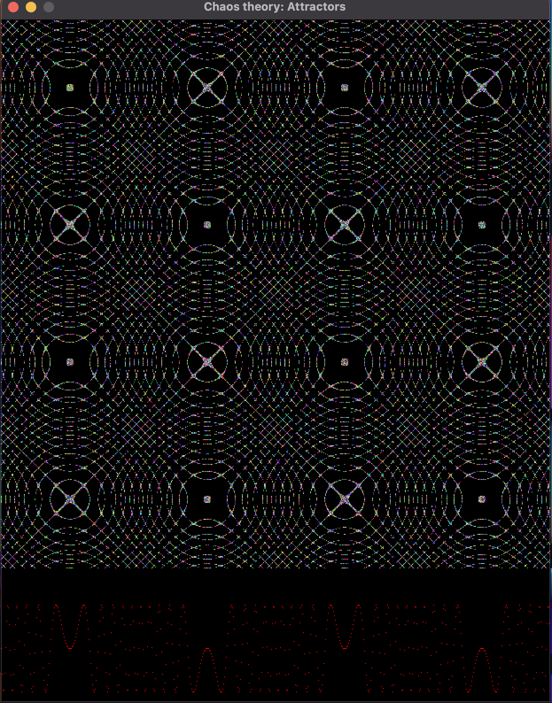

# Attractors : Chaos theory

- ref: http://www.3d-meier.de/tut19/Seite0.html

## Recurrence plot



## Field Simulation

- inspired from [this](https://www.instagram.com/reel/C5rnOYRRP1r/?utm_source=ig_web_copy_link&igsh=MzRlODBiNWFlZA==) video, I tried to simulate the field given by the following differential equation:

```
dx/dt = cos(3*y)
dy/dt = sin(3*x)
```
